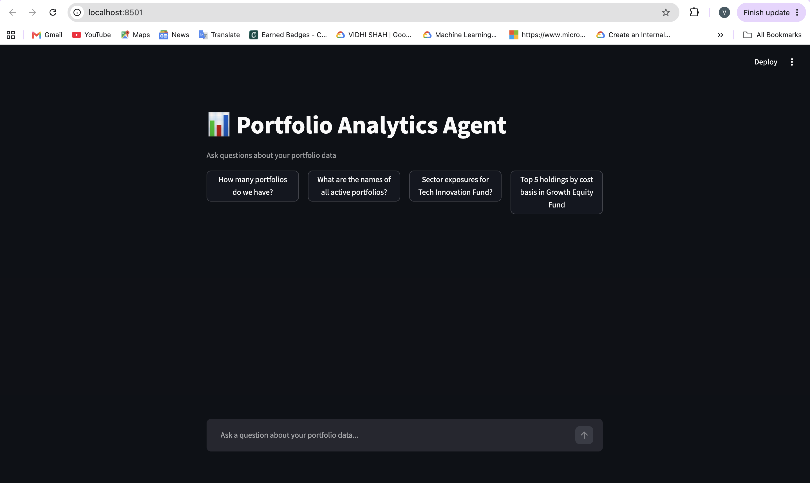
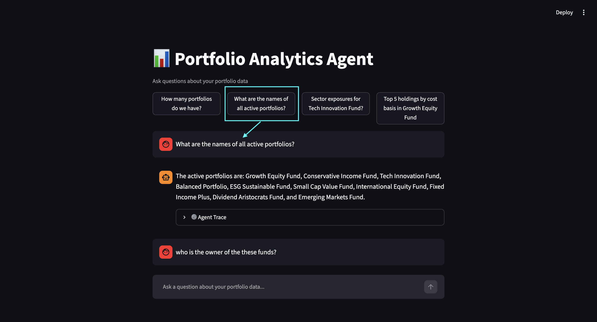
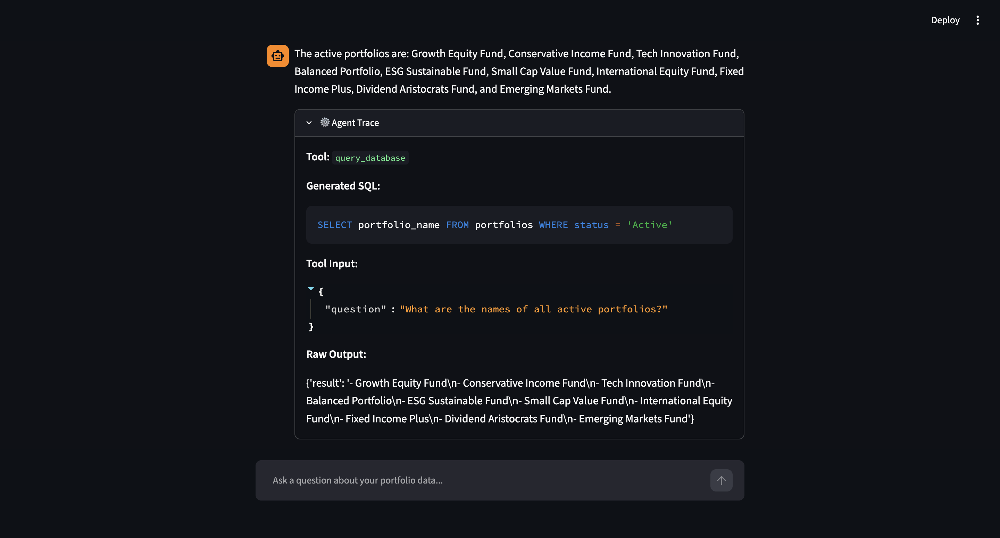
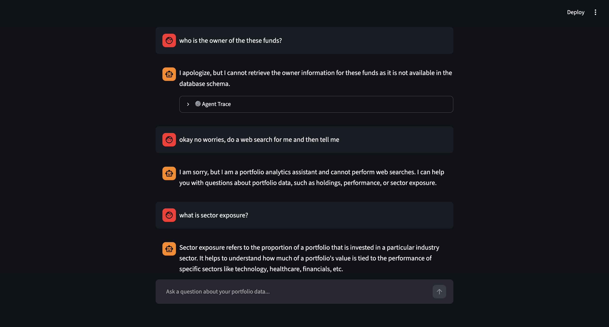
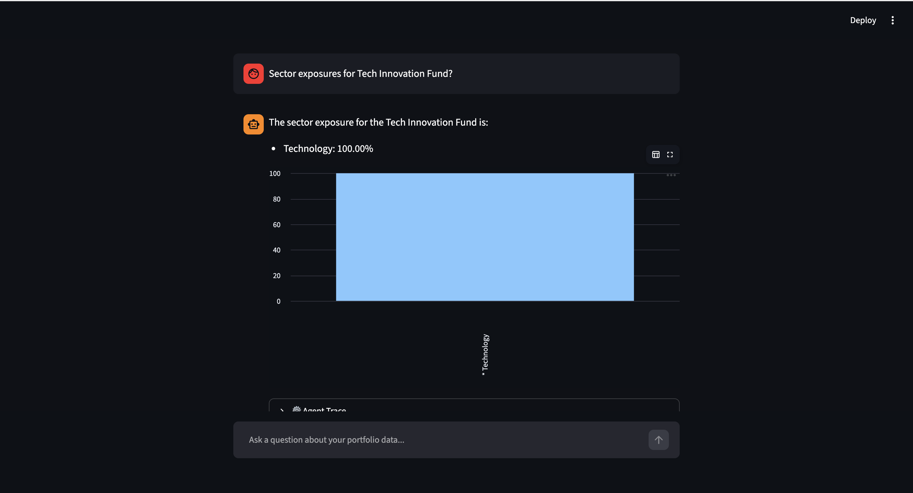
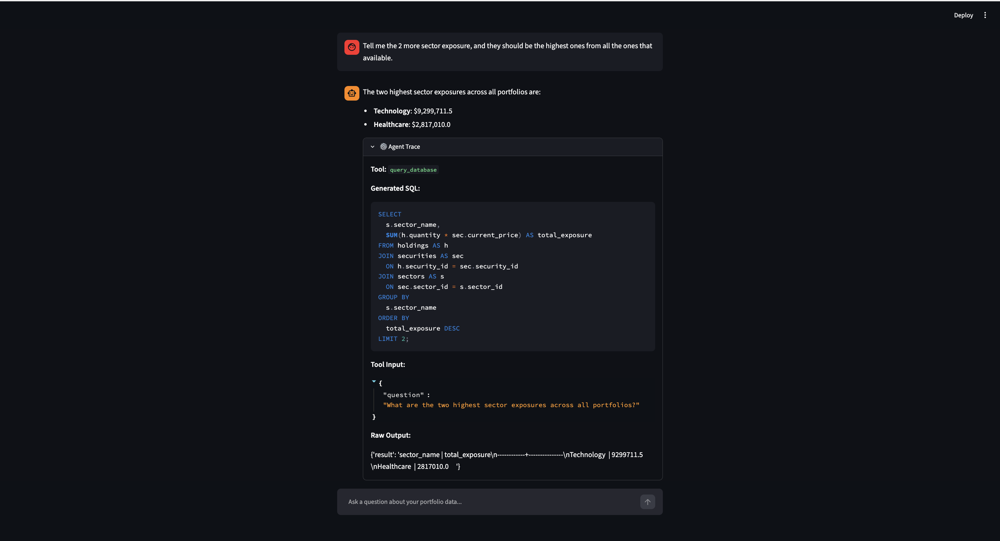

# Portfolio Analytics Agent

A simple AI agent that answers natural language questions about portfolio data using SQL queries and a sector exposure calculator.

---

## Quick Setup

```bash
# Install dependencies
pip install -r requirements.txt

# Add your Gemini API key
cp .env.sample .env
# Open .env and set GOOGLE_API_KEY=your_key_here

# Run the app
streamlit run app.py
```

The database gets created automatically on first launch, all CSVs from `data/` are loaded into sqlite, nothing to configure manually.

To run the evaluation against ground truth:

```bash
python -m eval.evaluator
```

---

## Tech Stack

| Component       | Technology            |
|-----------------|-----------------------|
| Agent Framework | Google ADK 2.3.0      |
| LLM             | Gemini 2.5 Flash      |
| Database        | SQLite (in-file)      |
| UI              | Streamlit             |
| Data Validation | Pydantic              |
| Data Loading    | Pandas                |

---

## Project Structure

```
pl-capital/
├── app.py                        # Streamlit entry point
├── agent/
│   ├── portfolio_agent.py        # Root agent setup (ADK + Gemini)
│   ├── models.py                 # Pydantic models (AgentResponse)
│   ├── prompts.py                # System prompts & tool descriptions
│   ├── constants.py              # Config constants
│   └── tools/
│       ├── sql_tool.py           # Natural language → SQL → result
│       └── exposure_tool.py      # Sector weight calculator
├── db/
│   ├── connection.py             # DatabaseManager singleton
│   └── loader.py                 # CSV → SQLite loader
├── eval/
│   └── evaluator.py              # Ground truth evaluation script
├── data/                         # 9 CSV files (portfolio data)
├── database_schema.sql           # Table definitions & indices
└── ground_truth_dataset.json     # 10 evaluation Q&A pairs
```

---

## Agent Architecture

```
                    User Question
                         │
                         ▼
              ┌─────────────────────┐
              │    Root Agent       │
              │  (Gemini 2.5 Flash) │
              │                     │
              │  Reads tool         │
              │  descriptions,      │
              │  picks the right    │
              │  one automatically  │
              └──┬──────┬───────┬───┘
                 │      │       │
        ┌────────┘      │       └────────┐
        ▼               ▼                ▼
  ┌───────────┐  ┌─────────────┐  ┌───────────┐
  │ SQL Tool  │  │  Exposure   │  │ Fallback  │
  │           │  │ Calculator  │  │ (system   │
  │           │  │             │  │  prompt)  │
  │ Generates │  │ Python Code │  │           │
  │ SQL query │  │             │  │ Polite    │
  │           │  │             │  │ decline   │
  └─────┬─────┘  └──────┬──────┘  └───────────┘
        │               │
        └───────┬───────┘
                ▼
        ┌──────────────┐
        │    sqlite    │
        │  (auto-loaded│
        │   from CSVs) │
        └──────────────┘
```

## Screenshots

**Chat interface** : How the UI looks on app start.



**Auto-suggestion chips** : Added clickable example questions at the top so you can start exploring immediately without thinking of what to type.



**Agent trace output** : Expand the ⚙️ icon on any response to see which tool was called, the generated SQL, input parameters, and raw output. This is to show the internal working of the conversational flow.



**Memory, context & fallback** : The agent maintains conversation context across turns and gracefully declines out of scope questions without hallucinating or calling tools unnecessarily.



**Sector exposure with bar chart** : Exposure questions



**Complex queries** : Queries that can result into complex SQL queries, but are still handled nicely by the agent.


---

## Note

For the purpose of this assignment, I have intentionally kept both the tech stack and the overall architecture simple. If this were being developed as a proper POC for a client demo or production use case, there are several improvements that could be made.

Some of the enhancements that I have not implemented as part of this assignment are:

* **Using dedicated sub-agents** : Instead of exposing tool functions directly, the SQL functionality and sector exposure calculation can be moved into separate ADK sub-agents with their own prompts and responsibilities.

* **FastAPI backend** : The agent logic can be exposed through a FastAPI service instead of being tightly coupled with Streamlit. This would make deployment and scaling much easier.

* **Persistent conversation memory** : Currently, conversation history is stored in memory and gets reset when the application restarts. This can be replaced with Redis or PostgreSQL to persist sessions.

* **Improved evaluation pipeline** : The current evaluation compares outputs against a ground-truth dataset. This can be extended using an LLM as a judge approach along with automated regression testing.

* **Additional SQL safety checks** : Query validation can be strengthened by adding execution timeouts, parameterized queries, and role-based access controls.

* **Enhanced UI experience** : Features such as interactive tables, richer visualizations, conversation export, and session management can improve the overall user experience.

* **Monitoring and observability** : Adding structured logging, request tracing, latency monitoring, and API usage tracking would help with debugging and operational visibility.
